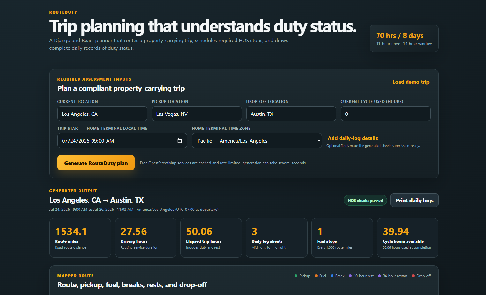
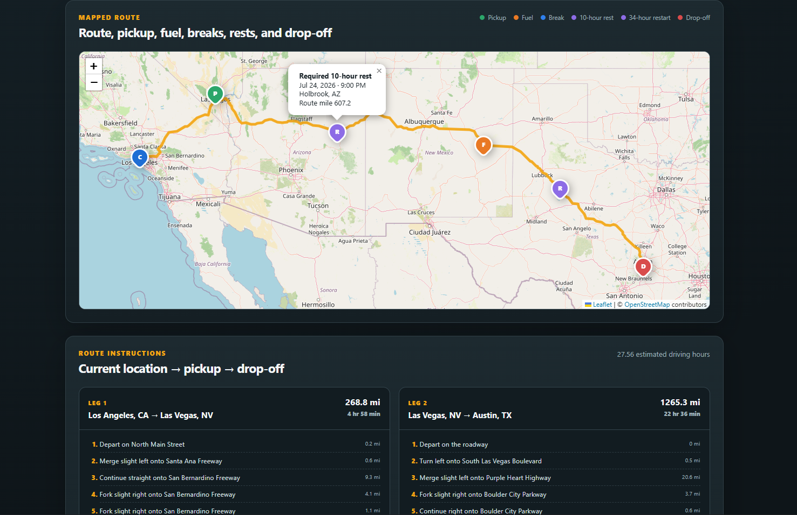
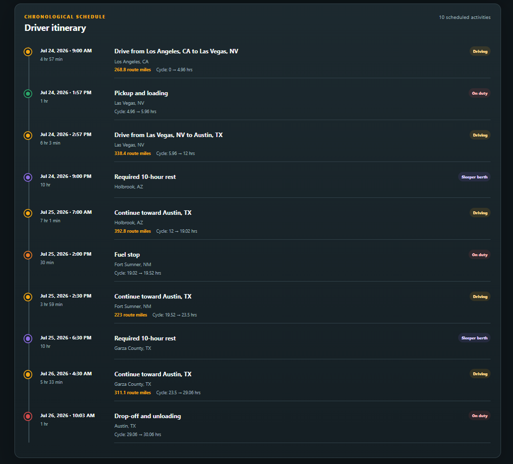
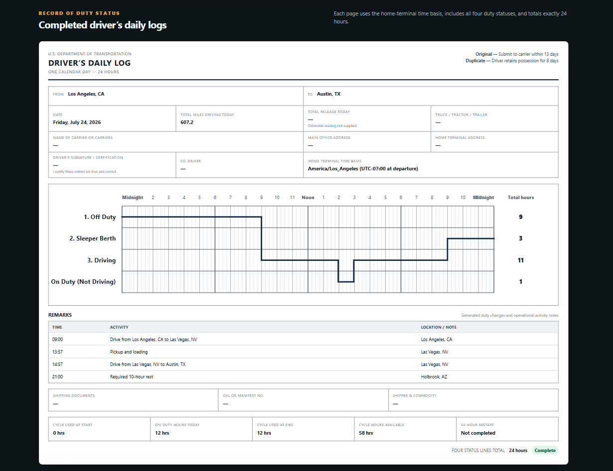

# RouteDuty

RouteDuty is a full-stack trip planner for property-carrying commercial drivers. It accepts the driver's current location, pickup location, drop-off location, and current 70-hour/8-day cycle usage.

It then generates:

- A road route through all three locations
- Separate current-to-pickup and pickup-to-drop-off route legs
- A chronological Hours-of-Service trip schedule
- Pickup, fuel, break, rest, restart, and drop-off markers
- Completed Driver's Daily Log sheets for each trip day
- Duty-status totals, mileage, remarks, and cycle information
- Print-ready daily log output

The application was built using **Django REST Framework** and **React with Vite**.

---

## Live Demo

- **Live Application:** https://route-duty-eld-trip-planner.vercel.app
- **Backend API:** https://routeduty-api.onrender.com
- **Backend Health Check:** https://routeduty-api.onrender.com/api/health/
- **Loom Walkthrough:** https://www.loom.com/share/fd6d843e3637418abd2d773c78c242c9
- **GitHub Repository:** https://github.com/zaafir7/route-duty-eld-trip-planner

> The backend is hosted on Render's free service and may take a short time to wake up after a period of inactivity.

---

## Screenshots

### Trip Planner and Generated Summary



### Generated Route Map



### Driver Trip Itinerary



### Daily Driver Log Sheet



---

## Main Features

### Trip Planning

- Accepts the current location, pickup location, and drop-off location
- Accepts the driver's current 70-hour/8-day cycle usage
- Calculates road distance and estimated driving time
- Separates the route into current-to-pickup and pickup-to-drop-off legs
- Displays route instructions and mapped activity markers

### Hours-of-Service Scheduling

The scheduling engine applies the assessment's property-carrying assumptions:

- Maximum of 11 driving hours after 10 consecutive hours off duty
- No driving after the 14th consecutive hour after coming on duty
- A 30-minute non-driving interruption after 8 cumulative driving hours
- A maximum of 70 on-duty hours during 8 consecutive days
- A 34-hour restart when the available simplified cycle balance is exhausted
- One hour of On Duty, Not Driving time for pickup
- One hour of On Duty, Not Driving time for drop-off
- Thirty minutes of On Duty, Not Driving time for fueling
- Fuel stops at every full 1,000 route miles
- No adverse-driving, short-haul, or split-sleeper exceptions

### Daily Driver Logs

- Generates one midnight-to-midnight log for every trip day
- Displays Off Duty, Sleeper Berth, Driving, and On Duty Not Driving
- Includes mileage and activity remarks
- Includes cycle-use and cycle-availability information
- Confirms that each day's four duty-status totals equal exactly 24 hours
- Supports browser printing and print-ready output

### Validation

The generated schedule is independently replayed and checked for:

- 11-hour driving-limit compliance
- 14-hour driving-window compliance
- 30-minute interruption compliance
- 70-hour cycle compliance
- Daily rest requirements
- 34-hour restart placement
- Fuel-stop placement
- Chronological event ordering
- Daily log boundaries
- Exact 24-hour duty-status totals
- Route-mile and driving-duration consistency

---

## Important Scheduling Behaviour

The scheduling engine models driving eligibility separately from general on-duty work.

This means:

- The 11-hour, 14-hour, and 70-hour limits prevent additional driving.
- Pickup, drop-off, and fueling can finish even when a driving limit has been reached.
- A required rest or restart is inserted before the next driving segment.
- Pickup, drop-off, or fueling can satisfy the 30-minute interruption when the activity provides at least 30 consecutive minutes without driving.
- The route service's returned driving duration is used instead of a fixed average speed.
- Every daily log uses one explicit home-terminal time zone.
- Events continuing through midnight are split correctly without creating false status-change remarks.

Detailed scheduling information is available in:

- [`docs/HOS_LOGIC.md`](docs/HOS_LOGIC.md)
- [`docs/VALIDATION.md`](docs/VALIDATION.md)
- [`docs/TEST_CASES.md`](docs/TEST_CASES.md)

---

## Assumptions and Limitations

### Cycle Calculation

The assessment provides only one `current_cycle_used` value. A precise rolling eight-day calculation would require the driver's individual on-duty totals for each preceding day.

RouteDuty therefore uses the following simplified balance:

```text
available cycle hours = 70 - current cycle used
```

When the available balance is exhausted, the planner schedules a 34-hour restart before additional driving.

This assumption is disclosed in the user interface and API response.

### Routing

The route is generated using a public OSRM driving profile.

It is a general road-route estimate and is not certified commercial-truck navigation. It does not account for:

- Truck height
- Truck weight
- Hazardous-material restrictions
- Commercial vehicle restrictions
- Bridge clearances
- Road-specific truck prohibitions

En-route markers are approximate positions along the route. An operational driver would still need to confirm a safe and legal fuel, parking, or rest facility.

---

## Technology Stack

### Backend

- Python
- Django
- Django REST Framework
- Requests
- Django cache
- WhiteNoise
- Gunicorn

### Frontend

- React
- Vite
- JavaScript
- React Leaflet
- Leaflet
- SVG duty-status graph rendering
- Responsive CSS
- Print-specific CSS

### Mapping Services

- Nominatim for primary geocoding and reverse geocoding
- Photon as a fallback geocoding service
- OSRM for route geometry, distance, duration, and instructions
- OpenStreetMap tiles for map display

Geocoding requests are cached to reduce repeated external-service calls.

### Deployment and CI

- Vercel for the React frontend
- Render for the Django backend
- GitHub Actions for automated testing and frontend builds

---

## Project Structure

```text
route-duty-eld-trip-planner/
├── .github/
│   └── workflows/
│       └── ci.yml
│
├── backend/
│   ├── eld_project/
│   │   ├── settings.py
│   │   └── urls.py
│   │
│   ├── trips/
│   │   ├── hos_calculator.py
│   │   ├── mapping.py
│   │   ├── serializers.py
│   │   ├── views.py
│   │   ├── urls.py
│   │   └── tests.py
│   │
│   ├── scripts/
│   │   └── stress_validate_hos.py
│   │
│   ├── manage.py
│   └── requirements.txt
│
├── frontend/
│   ├── src/
│   │   ├── components/
│   │   ├── App.jsx
│   │   └── index.css
│   │
│   ├── .env.example
│   ├── package.json
│   └── vercel.json
│
├── docs/
│   ├── screenshots/
│   │   ├── route-overview.png
│   │   ├── route-map.png
│   │   ├── driver-itinerary.png
│   │   └── daily-log-sheet.png
│   │
│   ├── reference/
│   │   └── blank-paper-log.png
│   │
│   ├── HOS_LOGIC.md
│   ├── TEST_CASES.md
│   ├── VALIDATION.md
│   ├── LOOM_SCRIPT.md
│   └── SUBMISSION_CHECKLIST.md
│
├── .gitignore
├── README.md
└── render.yaml
```

---

## Running the Project Locally

### Requirements

Install the following before starting:

- Python 3.10 or newer
- Node.js and npm
- Git

Clone the repository:

```bash
git clone https://github.com/zaafir7/route-duty-eld-trip-planner.git
cd route-duty-eld-trip-planner
```

---

## Backend Setup

Move into the backend folder:

```bash
cd backend
```

Create a Python virtual environment:

```bash
python -m venv .venv
```

Activate it on Windows PowerShell:

```powershell
.venv\Scripts\Activate.ps1
```

Activate it on Windows Command Prompt:

```cmd
.venv\Scripts\activate
```

Activate it on macOS or Linux:

```bash
source .venv/bin/activate
```

Install the required packages:

```bash
pip install -r requirements.txt
```

Apply database migrations:

```bash
python manage.py migrate
```

Start the Django development server:

```bash
python manage.py runserver
```

The backend will normally be available at:

```text
http://localhost:8000
```

Backend endpoints:

```text
Health check:
http://localhost:8000/api/health/

Trip planning:
http://localhost:8000/api/plan-trip/
```

---

## Frontend Setup

Open another terminal from the project root and move into the frontend folder:

```bash
cd frontend
```

Install the dependencies:

```bash
npm install
```

Create the local environment file on Windows:

```cmd
copy .env.example .env
```

On macOS or Linux:

```bash
cp .env.example .env
```

The local environment file should contain:

```env
VITE_API_BASE_URL=http://localhost:8000
```

Start the Vite development server:

```bash
npm run dev
```

Open the displayed Vite address, normally:

```text
http://localhost:5173
```

---

## API Request Example

Endpoint:

```text
POST /api/plan-trip/
```

Example request body:

```json
{
  "current_location": "New York, NY",
  "pickup_location": "Washington, DC",
  "dropoff_location": "Miami, FL",
  "current_cycle_used": 0,
  "start_time_local": "2026-07-24T08:00",
  "home_terminal_timezone": "America/New_York",
  "driver_name": "Alex Morgan",
  "carrier_name": "Northstar Freight LLC",
  "main_office_address": "New York, NY",
  "home_terminal_address": "New York, NY",
  "vehicle_numbers": "TRK-101 / TRL-101",
  "shipping_document_number": "BOL-2026-001",
  "manifest_number": "MAN-2026-001",
  "shipper_commodity": "General freight"
}
```

Only the following four assessment fields are required:

```text
current_location
pickup_location
dropoff_location
current_cycle_used
```

The interface provides default values for the start time and home-terminal time zone. The remaining logbook fields are optional.

---

## Testing

### Backend Tests

From the backend directory, run:

```bash
python manage.py test
```

The project currently includes **22 Django tests**.

Test scenarios include:

- Current-location driving before pickup
- Route-distance and driving-duration consistency
- The 30-minute interruption after 8 cumulative driving hours
- Pickup satisfying the interruption requirement
- Ten-hour daily rest after the driving limit
- Fuel at exact 1,000-mile thresholds
- Multiple fuel thresholds
- Non-driving work after driving eligibility ends
- A 34-hour restart before later driving
- Multiple daily logs
- Midnight boundary handling
- Time-zone validation
- Daylight-saving skipped and repeated times
- API input validation
- API response structure
- Independent itinerary replay

### Randomized HOS Validation

Run the randomized validation script from the backend folder:

```bash
python scripts/stress_validate_hos.py
```

The finished project was validated using **5,000 randomized schedule replays**.

### Frontend Production Build

From the frontend directory, run:

```bash
npm run build
```

### Frontend Dependency Audit

```bash
npm audit
```

---

## Deployment

### Backend Deployment on Render

The backend deployment is configured using `render.yaml`.

General deployment process:

1. Push the repository to GitHub.
2. Create a Render Blueprint from the repository.
3. Allow Render to read the `render.yaml` configuration.
4. Deploy the Django backend.
5. Copy the generated Render service URL.

Production backend:

```text
https://routeduty-api.onrender.com
```

Health check:

```text
https://routeduty-api.onrender.com/api/health/
```

### Frontend Deployment on Vercel

General deployment process:

1. Import the GitHub repository into Vercel.
2. Set the project root directory to `frontend`.
3. Add the production environment variable:

```env
VITE_API_BASE_URL=https://routeduty-api.onrender.com
```

4. Deploy the frontend.

Production frontend:

```text
https://route-duty-eld-trip-planner.vercel.app
```

---

## Continuous Integration

The GitHub Actions workflow runs automatically when code is pushed or a pull request is created.

The workflow checks:

- Django tests
- Frontend dependency installation
- Frontend production build

Workflow file:

```text
.github/workflows/ci.yml
```

---

## Assessment Deliverables

- Live React application
- Live Django REST API
- Public GitHub repository
- Route mapping
- Hours-of-Service scheduling
- Daily driver log sheets
- Automated backend tests
- Randomized HOS validation
- GitHub Actions workflow
- Deployment documentation
- Application screenshots
- Loom walkthrough

---

## Loom Walkthrough

A live walkthrough of the deployed application is available here:

https://www.loom.com/share/fd6d843e3637418abd2d773c78c242c9

The walkthrough demonstrates:

- Live trip generation
- Route summary
- Map and route markers
- Chronological trip schedule
- Generated daily logs
- Backend scheduling code
- Automated tests
- GitHub repository and deployment

---

## References

The scheduling assumptions were based on:

- FMCSA Hours of Service regulations for property-carrying drivers
- 49 CFR § 395.3
- The supplied FMCSA Driver's Guide to Hours of Service

Additional implementation details are documented in the `docs` directory.

---

## Disclaimer

RouteDuty is a hiring-assessment demonstration.

It is not:

- A certified Electronic Logging Device
- A commercial dispatch system
- A carrier compliance service
- Legal or regulatory advice
- Certified commercial-truck navigation software

Routes, stop locations, driving times, and generated logs must be independently verified before any real-world operational use.

---

## Author

**Muhammad Zaafir Zia**

GitHub: https://github.com/zaafir7